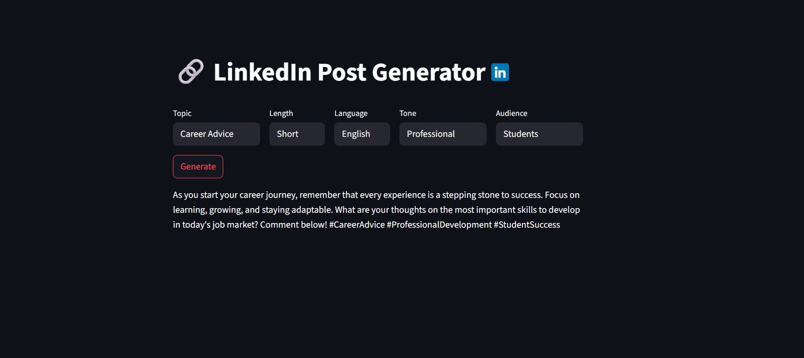

# LinkedIn Post Generator

**LinkedIn Post Generator** is a Streamlit web app that helps you quickly create personalized and engaging LinkedIn posts. Choose the topic, post length, language, tone, and audience, and get a professionally formatted LinkedIn post generated in seconds.

---

## Features

- Select from multiple **topics** dynamically loaded from sample datasets
- Choose **post length:** Short, Medium, or Long
- Write posts in **English** or **Hinglish**
- Pick your desired **tone**: Motivational, Friendly, Professional, Humorous, etc.
- Define the **audience**: Recruiters, Students, Entrepreneurs, and more
- Emoji-enhanced dropdown options for better UX
- Responsive, dark-mode-friendly UI with LinkedIn logo branding
- Instant post preview with preserved formatting

---

## Screenshot

---

## Installation

1. **Clone the repository:**

2. **Create a virtual environment and activate it (recommended):**

3. **Install dependencies:**

4. **Run the app locally:**

---

## Usage

- Pick your **topic**, **length**, **language**, **tone**, and **audience** from the dropdown menus.
- Click on the **“Generate Post”** button.
- View the generated LinkedIn post instantly below the input form.
- Copy the post content and share it on your LinkedIn profile easily!

